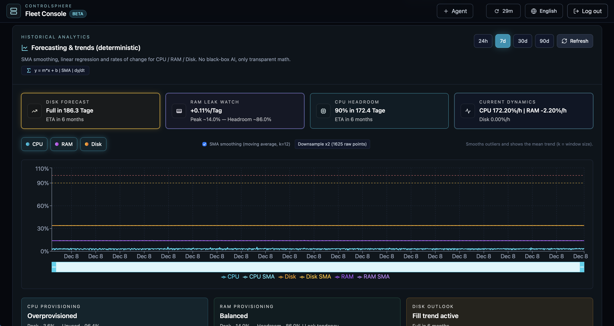
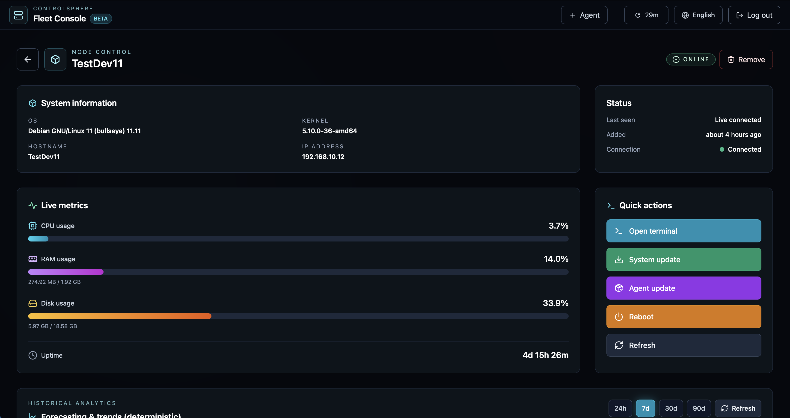
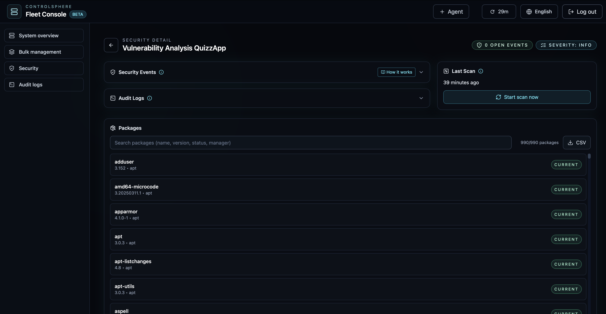
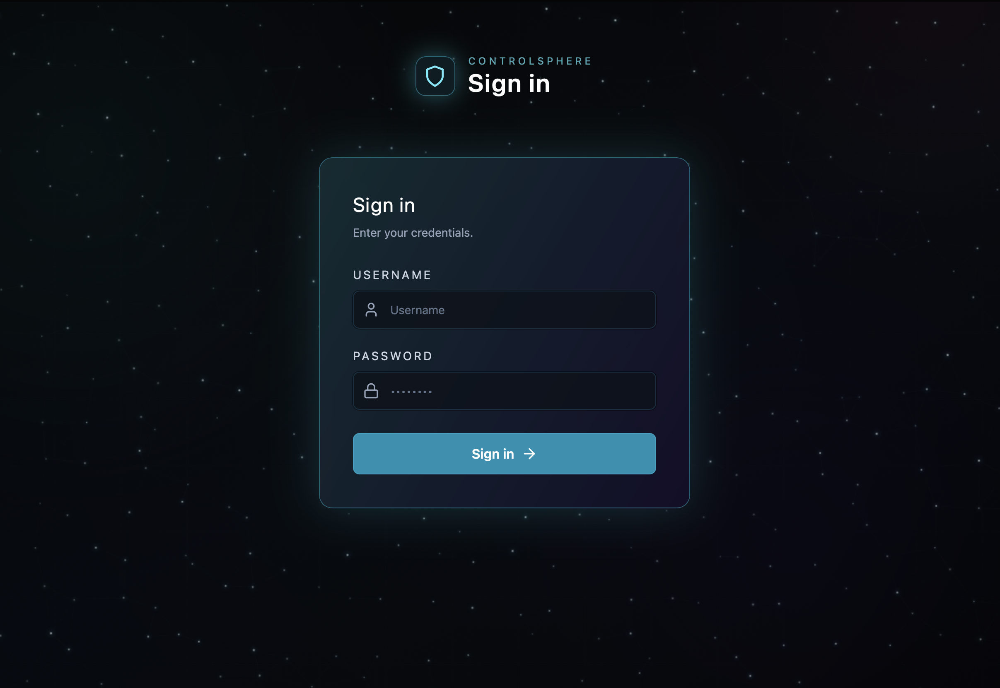

# ControlSphere  

**Your entire infrastructure. One dashboard. Zero complexity.**

ControlSphere gives you real-time visibility and full control over all your Linux systems — from a single, open-source web interface. Monitor live metrics, run terminal sessions, scan for CVEs, and manage packages across dozens of servers simultaneously. No SaaS subscriptions. No vendor lock-in. Runs entirely on your own hardware.

Born from the need to manage servers without the cost of large operators, and made fully available under the Apache 2.0 licence so every company and organisation can deploy, adapt, and benefit freely.

---

## What it looks like

### Live System Monitoring

*Real-time CPU, RAM, disk usage, and uptime across all connected systems*

### System Details & Remote Terminal

*Full system info, live metrics, interactive terminal, and one-click actions — in one view*

### Security & CVE Overview

*CVE matches, security events, package health, and audit logs across your entire fleet*

### Secure Login

*JWT-based authentication with a clean, modern interface*

---

## Why ControlSphere

| | ControlSphere | Typical SaaS tools |
|---|---|---|
| Cost | Free, self-hosted | $50–$500 / month |
| Data ownership | 100% yours | Vendor's servers |
| CVE scanning | Built-in, offline | Add-on or missing |
| Agent footprint | Single Go binary | Heavy daemons |
| Setup time | ~2 minutes | Hours of config |
| Open source | Apache 2.0 | Rarely |

---

## Get started in 2 minutes

### 🐳 Option A — Docker (recommended for testing & production)

Truly zero-config. No `.env` file, no passwords, no prerequisites.

> **[→ docker-compose.yml](docker-compose.yml)** — open, copy, deploy. That's it.

```bash
docker compose up -d
```

Open **http://localhost:3000** — done.

All secrets (`POSTGRES_PASSWORD`, `JWT_SECRET`, `SESSION_TOKEN_SECRET`) are generated automatically on first startup and persisted in a Docker volume. PostgreSQL is included and runs internally — never exposed to the network. The server image is pulled directly from GitHub Container Registry — no clone or build required.

> **TrueNAS / Portainer / Unraid**: Just paste the `docker-compose.yml` content into your custom app YAML editor and deploy. The image is pulled automatically from `ghcr.io/timexx/controlsphere:latest`. Nothing else needed.

> **Synology / QNAP / NAS with slow connections**: If `docker compose up` fails with a registry timeout, see the [NAS Deployment Guide](docs/deployment/NAS-DOCKER-GUIDE.md) for a pre-optimised local-build setup.

**Useful Docker commands:**
```bash
docker compose logs -f server       # follow server logs
docker compose logs -f postgres     # follow database logs
docker compose down                 # stop
docker compose down -v              # stop + delete all data (resets secrets)
docker compose up -d --build        # rebuild after a code change
```

**Want to override secrets?** Set any of these as environment variables in a `.env` file or in your container platform:
- `POSTGRES_PASSWORD` — database password
- `JWT_SECRET` — JWT signing key
- `SESSION_TOKEN_SECRET` — session HMAC key
- `PORT` — host port (default: 3000)

---

### ⚙️ Capacity & resource configuration

Pick the profile that matches your fleet size and run `docker compose` with the matching file — everything is pre-configured, nothing to edit.

| Profile | Agents | Server CPU | Server RAM | Postgres RAM | Disk | Metrics growth/day | Config file |
|---------|-------:|:----------:|:----------:|:------------:|:----:|:-----------------:|:-----------:|
| **Micro** | 1 – 10 | 0.5 vCPU | 512 MB | 256 MB | 20 GB | ~6 MB | [→ Deploy](deploy/docker-compose.micro.yml) |
| **Small** | 10 – 50 | 1 vCPU | 1 GB | 512 MB | 50 GB | ~56 MB | [→ Deploy](deploy/docker-compose.small.yml) |
| **Medium** | 50 – 200 | 2 vCPU | 2 GB | 1 GB | 200 GB | ~225 MB | [→ Deploy](deploy/docker-compose.medium.yml) |
| **Large** | 200 – 500 | 4 vCPU | 4 GB | 2 GB | 500 GB | ~560 MB | [→ Deploy](deploy/docker-compose.large.yml) |

Each file is a full, standalone `docker-compose.yml` replacement — resource limits, DB pool size, and heartbeat intervals are all pre-tuned for the profile. Just download and deploy:

```bash
# Example: Small profile
docker compose -f deploy/docker-compose.small.yml up -d
```

> **Note on disk:** The `Metric` table has no automatic pruning. Disk consumption grows indefinitely — plan for at least 6 months of the listed daily rate, or add a cron job:
> ```sql
> DELETE FROM "Metric" WHERE "createdAt" < NOW() - INTERVAL '90 days';
> ```

---

### 🖥️ Option B — Native install (Debian/Ubuntu, RHEL, macOS, Alpine)

One script — it installs everything automatically (Node.js, PostgreSQL, dependencies, database).

```bash
git clone https://github.com/timexx/controlsphere.git
cd controlsphere
sudo ./setup-server.sh
```

> **Important:** You must clone the full repository first. Running `setup-server.sh` alone will fail because it needs the `server/` directory and all source files.

The script fully automates:
- ✅ Node.js 20 LTS (installs or upgrades automatically)
- ✅ PostgreSQL (installs if missing)
- ✅ Database user, database, and password (auto-generated)
- ✅ `JWT_SECRET` and `SESSION_TOKEN_SECRET` (generated via `openssl rand`)
- ✅ `server/.env` configured — nothing to edit manually
- ✅ npm dependencies, Prisma client, and database migrations

Then start the server:
```bash
cd server && npm run dev          # development
# — or —
cd server && npm run build && npm start   # production
```

Server runs at **http://localhost:3000**.

---

### 🤖 Adding systems (agents)

Once the server is running, open the dashboard and click **"+ Agent"** in the top bar. You'll see a ready-to-run install command — copy it and paste it into any Linux system you want to monitor:

```bash
curl -sSL https://your-server/install-agent.sh | sudo bash
```

The agent installs itself as a systemd service and the system appears in your dashboard automatically. Nothing else to configure.

**What the agent installer does:**
- Downloads the compiled binary for your architecture (amd64 / arm64)
- Writes `/etc/maintainer-agent/config.json`
- Registers and starts the `maintainer-agent` systemd service
- Connects to your server — and reconnects automatically after every reboot

---

## Features

**Monitoring & Visibility**
- Real-time CPU, RAM, disk, and uptime metrics across all systems
- Live status indicators (online / offline / error)
- Historical metric charts

**Fleet Management**
- Bulk operations: update all systems, run commands on multiple servers at once
- One-click quick actions: system update, reboot, custom commands
- Full command history per system

**Remote Access**
- Web-based interactive terminal with PTY support (SSH-like, directly in the browser)
- Copy & paste, dynamic resizing, coloured output
- Encrypted connection with fingerprint verification and full audit logging

**Security & Compliance**
- Automatic CVE database download — all packages matched against known vulnerabilities
- CSV export for audit reports and compliance documentation
- Port scanning — monitors all open ports across your fleet
- Package security scanner — highlights outdated packages that need updates
- Security event dashboard

**System & Access**
- JWT-based authentication
- Auto-discovery — agents register themselves on first connect
- Zero-config agent — single static binary, no external dependencies
- German and English UI

---

## Security model

- Every agent has a unique secret key — no shared credentials
- Agents connect **outbound only** — no inbound firewall rules needed
- All WebSocket connections are authenticated via JWT
- PTY sessions are encrypted and fingerprinted; every command is audit-logged
- Root access on agents is used only for system management operations

---

## Troubleshooting

**Agent does not appear in the dashboard**
```bash
sudo journalctl -u maintainer-agent -f       # live logs
sudo systemctl status maintainer-agent       # service status

# Test connection manually
/usr/local/bin/maintainer-agent -server ws://your-server:3000/ws/agent -key your-key
```

**Server does not start**
```bash
./setup-server.sh        # re-running the script fixes most issues
lsof -i :3000            # check if port is in use
cd server && npm run dev # shows detailed startup errors
```

---

## Development

**Server**
```bash
cd server
npm run dev            # start dev server with hot reload
npm run prisma:studio  # open database GUI
npm run lint           # lint
npm run test           # run tests
```

**Agent**
```bash
cd agent
go run main.go -server ws://localhost:3000/ws/agent -key test-key
go build               # build binary
```

**Cross-compile agent**
```bash
GOOS=linux GOARCH=amd64 go build -o maintainer-agent-linux-amd64
GOOS=linux GOARCH=arm64 go build -o maintainer-agent-linux-arm64
```

**Rebuild and deploy agents**
```bash
./rebuild-and-deploy-agents.sh
```

---

## Architecture

```
Browser  ──WebSocket──►  Next.js Server (Node.js)  ◄──WebSocket──  Go Agent (per system)
                               │
                         PostgreSQL (Prisma)
```

- **Server**: Next.js 14 App Router · Tailwind CSS · PostgreSQL via Prisma · Socket.io · WebSocket
- **Agent**: Single Go binary · gopsutil (metrics) · creack/pty (terminal) · gorilla/websocket

---

## Roadmap

- [x] Real-time monitoring dashboard
- [x] Remote terminal (PTY, encrypted, audit-logged)
- [x] Bulk operations across fleet
- [x] CVE scanning with CSV export
- [x] Historical metric charts
- [x] Package security scanner
- [x] Port monitoring
- [x] Audit logging
- [x] Multi-user support with roles
- [ ] Alert system (email / Slack / webhook for threshold events)
- [ ] File manager
- [ ] Custom scripts library

---

## License

ControlSphere is licensed under the **Apache License, Version 2.0** (SPDX: `Apache-2.0`).

**Copyright © 2025 Tim Klement**

```
http://www.apache.org/licenses/LICENSE-2.0
```

Distributed on an **"AS IS"** basis, without warranties or conditions of any kind.  
By contributing to this repository, you agree your contributions are licensed under the same Apache-2.0 licence.

---

*Built and maintained by **Tim Klement** · Contributions welcome · [Apache 2.0](http://www.apache.org/licenses/LICENSE-2.0)*
